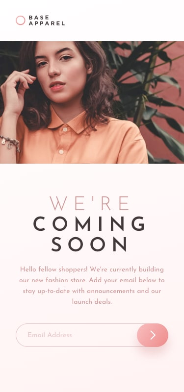

# Project 1- Landing Page für Base Apparel

In diesem Project habe ich die Challenge "Base Apparel" umgesetzt.

## Technologien 
- HTML5
- CSS3
- Responsive Design mit Media Queries

## Vorgehensweise 
1. Analyse des Mockups und der Design Vorhaben
2. Umsetzung der ersten Version mit HTML und CSS
3. Anpassung der Seite für Responsive

## Design Entscheidung 
- Mobile First Ansatz: In diesem Projekt habe ich einen mobile First Ansatz, da dies ein Best Practice im Frontend ist. Dazu habe ich Media Queries genutzt
- In diesem Projekt unterstütze ich alle gängigen Browser, auf Support für IE etc. wurde verzichtet
-getestet wurde die Webseite in Chrome und Firefox

**Autor**
Anna Gridasova 
